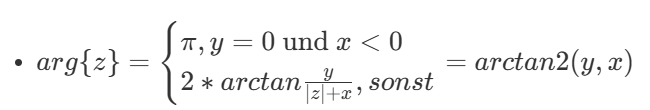
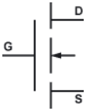
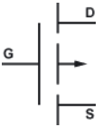
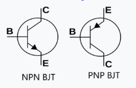
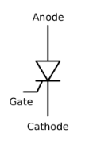
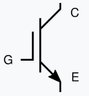

# Allgemein
## Integrale, Ableitungen
- Ist $a(t)$ konstant, gilt $\int{a(t)}dt = a*t$
- Ist die Änderung von $a(t)$ konstant, gilt $\frac{da(t)}{dt} = \frac{a(t_2) - a(t_1)}{t_2 - t_1}$ für beliebige Zeitpunkte $t_1 \neq t_2$
  - (Praxisrelevanter) Ist zusätzlich $a(t_1) = 0$, gilt $\frac{da(t)}{dt} = \frac{a(t)}{t}$

## Komplexe Zahlen
### Kartesisch
$z = x + jy$
- $x = Re\{z\}, y = Im\{z\}$
- Imaginäre Einheit $j² = -1$
  - $\frac{1}{j} = -j$
- Konjugiert $\overline{z}=z^*=x-jy$
  - $\overline{z}$ ist das "konjugiert-Komplexe" von $z$.
- Betrag $|z|=\sqrt{x²+y²}=\sqrt{z \overline{z}}$
- Teilen durch eine komplexe Zahl: Mit konjugiertem Nenner erweitern, dann wird der Nenner reell

### Polar
$z = r e^{j \varphi}, w = R e ^{j \psi}$
- $r = |z|, R = |w|$
- $\varphi = arg\{z\}, \psi = arg\{w\}$

- Multiplizieren: $zw = rR e^{j (\varphi + \psi)}$
  - "Betrag multiplizieren, Winkel addieren"
- Dividieren: $\frac{z}{w} = \frac{r}{R} e^{j (\varphi - \psi)}$
  - "Betrag dividieren, Winkel subtrahieren"

### Umwandlung

- $arg\{z\} = \begin{cases} \pi, y = 0 \text{ und } x < 0\\ 2 * arctan \frac{y}{|z| + x}, sonst \end{cases} = arctan2(y,x)$
  - In der Praxis ist diese Umwandlung nicht nötig. Falls doch, einfach mit normaler Trigonometrie arbeiten

- $x = r*cos(\varphi)$
- $y = r*sin(\varphi)$

## Einheitenpräfixe
|Präfix|Gesprochen|Faktor|
|--|--|--|
|T|Terra|$10^{12}$|
|G|Giga|$10^9$|
|M|Mega|$10^6$|
|k|kilo|$10^3$|
|-|-|$10^0=1$|
|m|milli|$10^{-3}$|
|$\mu$ (u)|mikro|$10^{-6}$|
|n|nano|$10^{-9}$|
|p|pico|$10^{-12}$|

# Grundlagen
## Widerstandsnetze
- Ohm'sches Gesetz: $U=R*I$
  - $[U] = V = Volt$
  - $[I] = A = Ampere$
  - $[R] = \Omega = Ohm$
- Reihenschaltung: $R_{ges} = R_1 + R_2 + ...$
- Parallelschaltung: $\frac{1}{R_{ges}} = \frac{1}{R_1} + \frac{1}{R_2} + ...$
  - Bei 2 Widerständen: $R_{ges} = \frac{R_1 * R_2}{R_1 + R_2} $
  - Bei gleichen Widerständen: $R_{ges} = \frac{R_{teil}}{n}$
- Spannungsteiler: $\frac{U_1}{U_2} = \frac{R_1}{R_2}$
  - Praxisrelevanter: $\frac{Teilspannung}{Gesamtspannung} = \frac{Teilwiderstand}{Gesamtwiderstand}$

## Kirchhoff
- "Alle Ströme die in einen Knoten hinein fließen, fließen auch wieder raus"
  - "Alle Ströme die in ein Bauteil (oder Teilnetz) fließen, fließen auch wieder raus"
- "Potentiale an einem Knoten sind überall am Knoten gleich"

## Leistung/Energie
- Leistung: $P = U*I$, bzw. $p(t) = u(t) * i(t) = \frac{dE(t)}{dt}$, $[P] = W = Watt$
  - Leistung an Widerstand: $P = R*I² = \frac{U²}{R}$
- Energie: $E = \int{p(t)}dt$, $[E] = J = Joule$
  - $1 kWh = 3'600'000 J$

## Wechselspannung
- Allgemein: $u(t) = û*sin(\omega t + \varphi) + DC$
- Kreisfrequenz: $\omega = 2 \pi f$
  - Frequenz $[f] = Hz = Hertz = \frac{1}{s}$
- Effektivwert: $U = \sqrt{\frac{1}{T} \int_{t_0}^{t_0 + T}u²(t)} dt$
  - Bei Gleichspannung: $U = u(t)$
  - Bei sinusförmiger Spannung: $U = \frac{û}{\sqrt{2}}$

# Kapazität/Induktivität

## Kapazität
- Kapazität: $[C] = F = Farad$
- Strom: $i = C \frac{du}{dt}$
  - Bei $C = 1F$ und $i = 1A$ steigt die Spannung um $1V$ pro Sekunde.
- Spannung: $u = \frac{1}{C} \int{i}dt$
- Energie in Kapazität: $E = \frac{1}{2} CU^2$
- Blindwiderstand $X_C = - \frac{1}{\omega C}$
- Reihenschaltung: $\frac{1}{C_{ges}} = \frac{1}{C_1} + \frac{1}{C_2} + ...$
  - Es gelten die gleichen Umformungen wie bei der parallelschaltung von Widerständen
- Parallelschaltung: $C_{ges} = C_1 + C_2 + ...$

### Lade-/Entladekurve
$\tau = R*C$

|Dauer|Lade/Entladestand|
|---|---|
|$1 \tau$|63 %|
|$2 \tau$|86 %|
|$3 \tau$|95 %|
|$4 \tau$|98 %|
|$5 \tau$|99 %|

## Induktivität
- Induktivität: $[L] = H = Henry$
- Strom: $i = \frac{1}{L} \int{udt}$
- Spannung: $u = L\frac{di}{dt} $
  - Bei $L = 1H$ und $u = 1V$ steigt der Strom um $1A$ pro Sekunde.
- Energie in Induktivität: $E = \frac{1}{2} LI^2$
- Blindwiderstand $X_L = \omega L$
- Reihenschaltung: $L_{ges} = L_1 + L_2 + ...$
- Parallelschaltung: $\frac{1}{L_{ges}} = \frac{1}{L_1} + \frac{1}{L_2} + ...$
  - Es gelten die gleichen Umformungen wie bei der parallelschaltung von Widerständen

# Komplexe Wechselstromrechnung
- Die Formeln gelten nur, wenn alle Quellen die gleiche Frequenz $f$ haben!
- Alle Beträge sind i.d.R. Effektivwerte.
- Kreisfrequenz $\omega = 2 \pi f$
- Komplexe Spannung, ausgeschrieben: $U = |U| e^{j \omega t} e^{j \varphi}$
  - Komplexer Drehzeiger (Spannung): $U = |U| e^{j*\varphi}$
  - Funktioniert für Strom und Leistung genauso
- Ohmsches Gesetz: $U = Z I$
- Scheinleistung $S = P + jQ = U \overline{I} = Z |I|^2 = \frac{|U|²}{\overline{Z}}$
  - $[S] = VA (=Watt)$
  - Wirkleistung $P = Re\{S\}$, $[P] = W = Watt$
  - Blindleistung $Q = Im\{S\}$, $[Q] = VAr (= Watt)$
  - Leistungsfaktor $cos(\varphi) = cos(arg\{S\}) = \frac{P}{S}$
    - (Wird im Handwerk gerne verwendet)
- Impedanz $Z = R + jX$
  - R = Wirkwiderstand, oder Ohm'scher Widerstand
  - X = Blindwiderstand, oder Reaktanz
  - $[Z] = [X] = [R] = \Omega$
- Impedanz Kapazität: $Z_L = \frac{1}{j \omega C} = -j \frac{1}{\omega C}$
- Impedanz Induktivität: $Z_L = j \omega L$

# Halbleiter
## Diodenarten
"Normale" Si-Schaltdiode:
- Vorwärtsspannung 0.6-1.2V, meistens 0.7V
- Rückwärtsspannung meist über 400V

"Kleine" LED:
- Vorwärtsspannung von Farbe abhängig (1.8-3.5V)
- Vorwärtsstrom meist 20mA für maximale Helligkeit ohne Überlastung
- Rückwärtsspannung gering
- Rückwärtsstrom abhängig von Beleuchtungsstärke

PIN-Diode:
- Vorwärtsspannung minimal höher als Schaltdiode
- Rückwärtsspannung höher als Si-Schaltdioden
- Deutlich langsamer als Schaltdiode

Shottky-Diode:
- Vorwärtsspannung sehr gering
- Rückwärtsspannung deutlich geringer, teilweise nur 20-30V
- Sehr schnell

Zener-Diode / Lawinen-Diode:
- Vorwärtsspannung sehr gering
- Rückwärtsspannung stark vom Bauteil abhängig
- Rückwärts-Durchbruch zerstört die Diode nicht
- Schnell

Diac:
- Symmetrischer Aufbau, Vorwärts-Verhalten ist gleich dem Rückwärts-Verhalten
- Vorwärtsspannung meist mehrere 10V, meist 30-40V
- Einschaltspannung ist höher als Ausschaltspannung (Hysterese)

## MOSFET
N-Kanal | P-Kanal:\

- D = "Drain" ("Abfluss, hier fließt der Strom rein")
- G = "Gate"
- S = "Source" ("Quelle, hier kommt der Strom raus")
- N-Kanal: Leitfähig von D nach S, wenn Gate-Source-Spannung $U_{GS}$ die Tresholdspannung $U_{TH}$ überschreitet
- P-Kanal: Leitfähig von D nach S, wenn Source-Gate-Spannung $U_{SG}$ die Tresholdspannung $U_{TH}$ überschreitet
- MOSFETs haben eine Rückwärtsdiode (Typ PIN-Diode) von S nach D
- $I_{DS}$ wird durch $U_{GS}$ begrenzt

## BJT

- C = "Collector"
- B = "Base" = "Basis"
- E = "Emitter" ("Immer am Pfeil")
- (N-Kanal) $I_{CE(Max)} = h I_{BE}$
  - h = Verstärkungsfaktor
  - Basisstrom fließt immer entlang des Pfeils
- Der Pfeil entspricht einer Diode mit meist 0.7V Vorwärtsspannung

## Thyristor

- Schaltet ein, wenn $I_{GC}$ einen gewissen Wert überschreitet
- Schaltet aus, wenn $I_{AC}$ einen gewissen Wert unterschreitet

## IGBT

- C = "Collector"
- G = "Gate"
- E = "Emitter"
- Mischung aus BJT und MOSFET 
- Gibts eigentlich nur als N-Kanal
- Leitfähig von C nach E, wenn Gate-Emitter-Spannung $U_{GE}$ die Tresholdspannung $U_{TH}$ überschreitet
- KEINE Rückwärtsdiode

# Operationsverstärker
Indizien für den Betriebsmodus. Der Reihe nach prüfen, bis eins zutrifft:
1. Es gibt keine Rückkopplung? >> Vergleicher
2. Die Rückkopplung ist verzögert, oder es gibt mehrere Rückkopplungen? >> Vermutlich Blinker o.Ä.
3. Die Rückkopplung "verstärkt" das Ausgangssignal? >> Mitkopplung
4. Die Rückkopplung beeinflusst nur das Potential an `+`? >> Vermutlich nicht invertierende Gegenkopplung
5. `+` liegt auf festem Potential? >> Vermutlich invertierende Gegenkopplung

## Regeln nach Betriebsart
Mit `+` und `-` sind die Potentiale am nicht-invertierenden und invertierenden Eingang gemeint.

Als Versorgungsspannung erhält der OpV $U_H$ (high) und $U_L$ (low).

Hier werden nur Regeln für IDEALE OpV gelistet.

### Vergleicher
- Ist `+` > `-`, wird das $U_H$ ausgegeben
- Ist `+` < `-`, wird das $U_L$ ausgegeben
- Das Ausgangssignal kann nur $U_H$, oder $U_L$ sein

### Mittkopplung
- Das Ausgangssignal "verstärkt sich selbst"
- Das Ausgangssignal kann nur $U_H$, oder $U_L$ sein

### Gegenkopplung
- Das Ausgangssignal "wirkt sich selbst entgegen"
- WICHTIGSTE REGEL: Das Ausgangssignal wird vom OpV so eingestellt, dass `+` = `-`

# Systemtheorie
## Decibel
Große Buchstaben sind in dB
- $lg = \log{10}$
- $A = 10lg(a)$
  - $A[dB] = A[dBm] - 30$
- $a = 10^{\frac{A}{10}}$
- $c = a*b$, $C = A + B$
- $c = \frac{a}{b}$, $C = A - B$
- Faustregeln zur Umrechnung:
  - $a * 2 => A + 3dB$
  - $a * 10 => A + 10dB$
  - $a² => A * 2$
- Für Spannungen: 
  - $U = 10lg(u²)=20lg(u)$
  - $u = 10^{\frac{U}{20}}$

