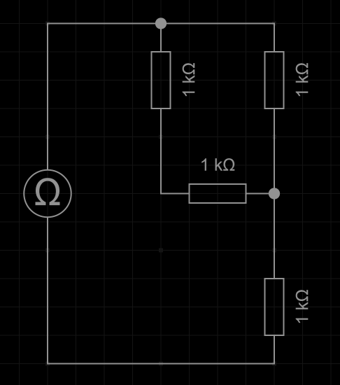
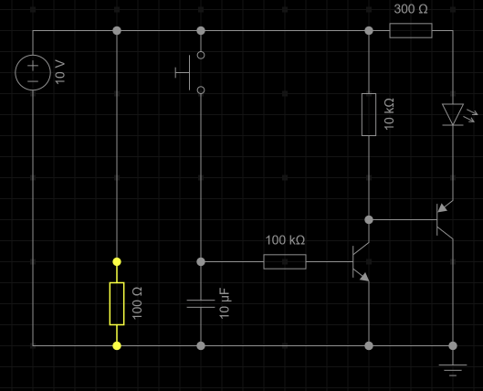
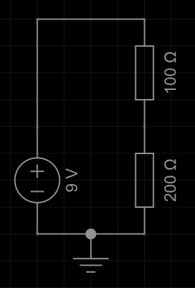
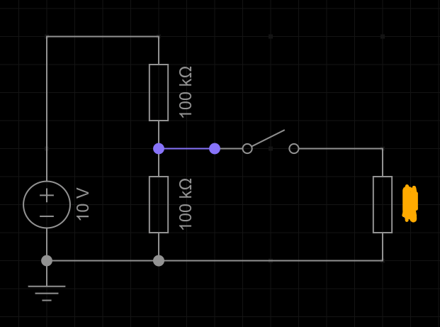
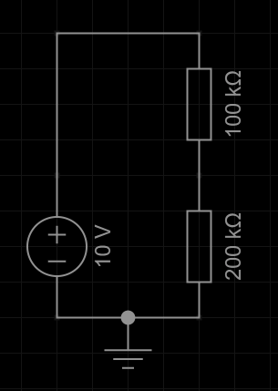
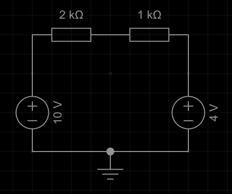
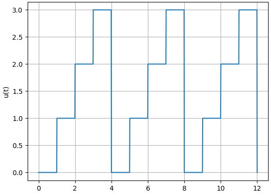

# 1. Kirchhoff und Ohm

1. Ist das Potential an einem Knoten immer überall an diesem Knoten gleich?
Wenn nein, in welchen Fällen nicht?
2. Berechne den Gesamtwiderstand folgender Schaltung:\

3. Du legst an einen unendlich großen Widerstand eine konstante Spannung an.
Wie groß ist der Stromfluss durch den Widerstand?
1. Du legst an einen unendlich großen Widerstand einen konstanten
Strom an.
Wie groß ist die Spannung über den Widerstand?
1. Du baust eine Schaltung nach einem Schaltplan auf, also richtig mit Lötkolben und Kabeln.
Aus Gründen möchtest du danach das Bezugspotential (Ground) an einen anderen Knoten verschieben.
Was musst du dazu an deiner bereits gebauten Schaltung verändern?
1. Gegeben ist folgende Schaltung:\
\
Wie viel Strom fließt durch den markierten Widerstand?

# 2. Spannungsteiler

1. Gegeben ist ein einfacher Spannungsteiler:\
\
Berechne den Strom durch beide Widerstände und das Potential in der Mitte.
2. Gegeben ist folgende Schaltung:\
\
Was lässt sich über die Spannung im blauen Knoten aussagen? Was passiert, wenn der Schalter geschlossen wird?
   1. Beide Widerstandswerte werden verdoppelt. Passe deine Antworten entsprechend an.
3. Durch welchen der Widerstände fließt mehr Strom? Über welchen der Widerstände fällt eine höhere Spannung ab?\

4. Bestimme das jeweilige Potential an jedem Knoten:\

# 3. Wechselspannung
1. Übliche Haussteckdosen in Deutschland haben eine Effektive Spannung von 230 V bei einer Frequenz von 50 Hz. Der maximale Strom beträgt laut Angabe üblicherweise 16 A. Berechne den Spitzenwert der Spannung.
2. Welche effektive Leistung kann eine einzelne Haussteckdose liefern?
3. Es wird ein $100 \Omega$ - Widerstand an die Steckdose angeschlossen. Bestimme den Spitzenwert des fließenden Stroms.

(Now for something completely different)
Gemessen wurde folgender Spannungsverlauf:\

4. Bestimme die üblichen Größen: Amplitude, Frequenz, Gleichspannungsanteil
5. Bestimme den Effektivwert

Falls du 2. nicht lösen kannst, nimm im Folgenden den Effektivwert $U = 3V$ an.

6. Die Spannung liegt an einem $10 \Omega$ Widerstand an. Bestimme die durchschnittliche Leistung.
7. Bestimme die Energie, die das gemessene Signal am Widerstand umgesetzt hat. Die x-Achse ist in Sekunden skaliert (beschriftet).
8. Bestimme den Effektivwert dieses Signals:\

# 4. Leistung und Energie
1. Ist es aus Ingenieurstechnischer Sicht sinnvoll, den Begriff "Energieverbrauch" zu nutzen?
2. Ein Gaming-PC hat einen durchschnittlichen Leistungsverbrauch von $300W$. Bestimme den jährlichen Energieverbraucht in kWh, wenn der PC 4 Stunden täglich genutzt wird.
3. Eine Batterie wurde getestet: Sie lieferte für 8 Stunden einen Strom von 1A bei 3.3V, danach für 2 Stunden 0.5A bei 2.8V. Wie viel Energie enthielt die Batterie zu beginn?
4. Bei Powerbanks wird als Einheit für die Energie mAh ("Milliamperestunden") angegeben. Die Ausgangsspannung wird (ohne Schnellladen) durch eine Schaltung bei 5V gehalten. Bestimme die Energiemenge in Joule, wenn die Powerbank $2200mAh$ angibt.
    1. Erstelle eine (möglichst) einfache Formel, um mAh in J umzurechnen.
5. Über einen 1/4-W-Widerstand sollen 10V abfallen. Wie groß ist der minimale Widerstandswert, bei welchem der Widerstand nicht überlastet wird?
6. In einem Hochspannungsnetz wird die Spannung stark erhöht, um den Strom entsprechend zu reduzieren. Die Leistung bleibt gleich. Erkläre, warum es sinnvoller ist, 1A bei 10000V zu übertragen, statt 10000A bei 1V. Die Leistung ist ja theoretisch die gleiche.
7. Ein (günstiges) Signal-Übertragungssystem sendet Gleichspannungs-Impulse mit entweder 5V, oder -5V Betrag über ein Kabel. Die Impulsdauer beträgt $1 \mu s = 10^{-6}s$. Bestimme die Energie eines einzelnen Impulses (Für Signalenergien wird ein Widerstandswert von $1 \Omega$ angenommen).
   1. Das System sendet 30'000 Mal pro Sekunde. Bestimme die durchschnittliche Leistung.
   2. Welche Leistung stellt das System in dem Moment zur Verfügung, während es gerade einen Impuls sendet?

