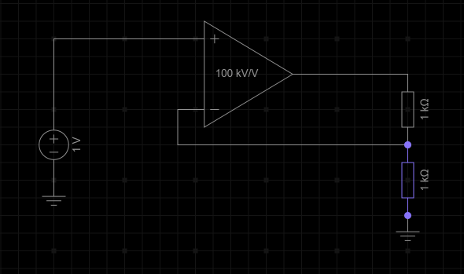
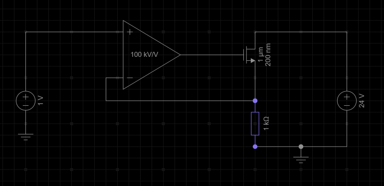
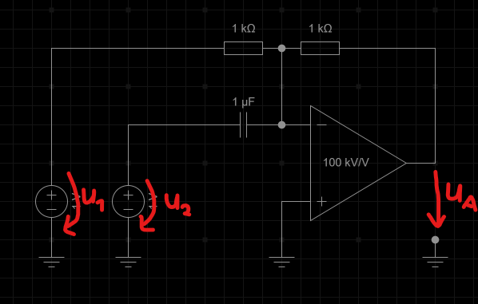
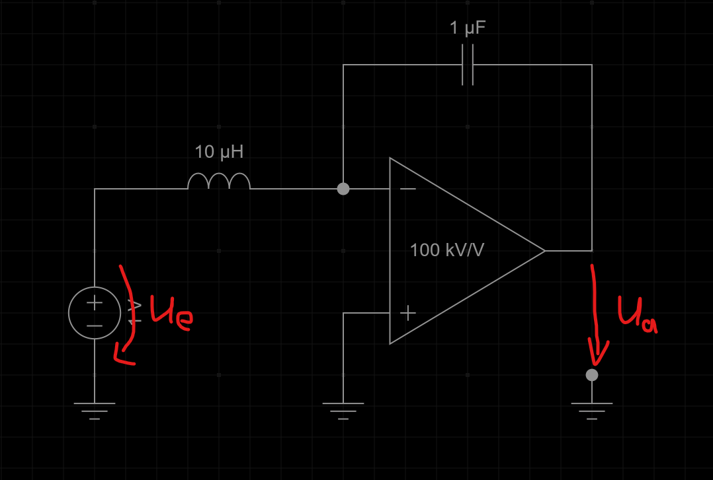

## 1. n. inv. OpV mit Gegenkopplung
1. Welche Spannung fällt über den markierten Widerstand ab?\

2. Welche Größen der Schaltung beeinflussen die Spannung über diesen Widerstand maßgeblich?
3. Welche Spannung fällt über den markierten Widerstand ab?\

4. Welche Größen der Schaltung beeinflussen die Spannung über diesen Widerstand maßgeblich?
5. Die links Spannungsquelle hat nun eine unbekannte Spannung $u$. Bestimme den Strom durch den blauben Widerstand $i$ in Abhängigkeit von $u$.
   1. Wie könnte man diese Schaltung nennen?

## 2. inv. OpV mit Gegenkopplung
1. Bestimme $u_a$ in Abhängigkeit von $u_1$ und $u_2$:\

2. Bestimme $u_a$ in Abhängigkeit von $u_e$:\

