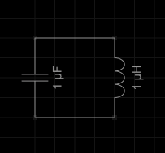
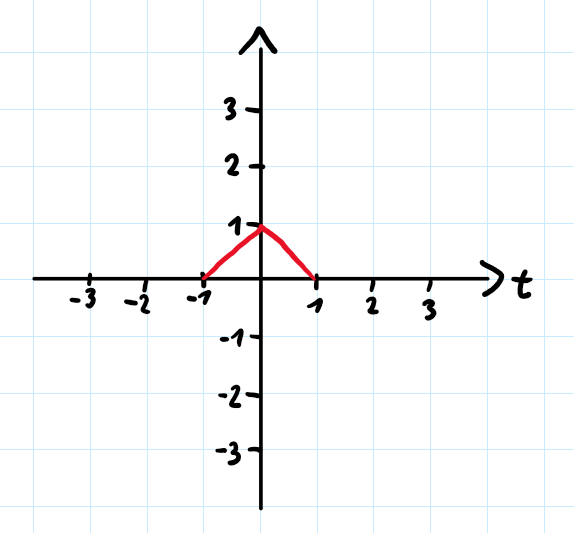
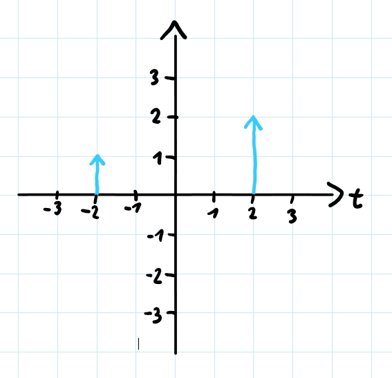
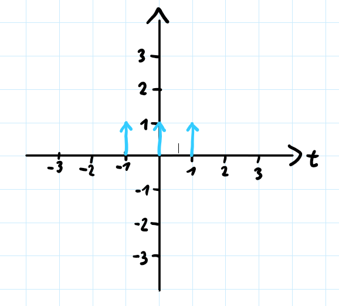
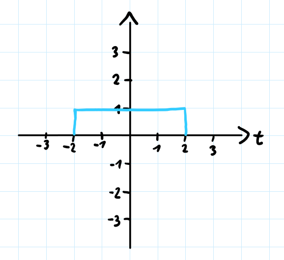

# 1. DGL aufstellen
Stelle eine DGL auf, die den Spannungsverlauf folgender Schaltung beschreibt:\

Statt der Parameter, nutze die Variablen (C und L).

# 2. Faltung
Gegeben sei folgender Signalverlauf:\

Falte den Verlauf mit folgenden Funktionen:

1. 

2. 

3.  

