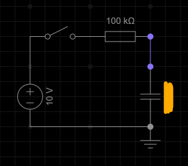
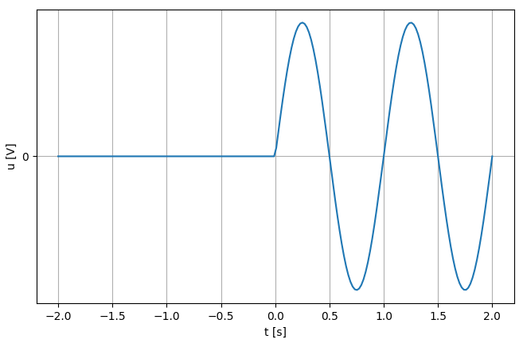
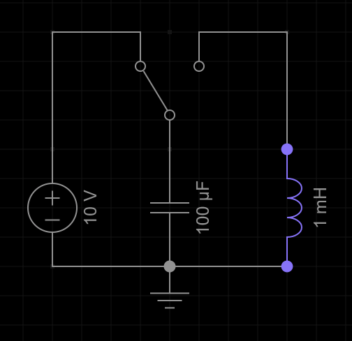

## 1. Kapazität
In dieser Übung wird die Kapazität verschiedener Kondensatoren auf unterschiedliche Weise bestimmt. Jeder Übungsteil bezieht sich auf einen anderen Kondensator.
1. Folgende Schaltung wird verwendet:\
\
Der Kondensator ist zu Beginn entladen. 10 Sekunden nachdem der Schalter geschlossen wurde, erreicht der blaue Knoten ein Potential von $9,5V$.
2. Der Kondensator ist zu Beginn entladen und wird mit einem konstanten Strom von 1mA geladen. Innerhalb von 0.1s steigt die Spannung am Kondensator auf 5V.
3. Der Kondensator hat zu Beginn eine Spannung von 3V und wird genau wie der vorherige Kondensator mit einem Strom von 1mA geladen, wodurch die Spannung innerhalb von 0.1s um 5V steigt (also beträgt die Spannung danach 8V).
4. Der Kondensator wird direkt an eine Sinusspannung angeschlossen. Die Sinusspannung hat eine Frequenz von 1kHz und eine Amplitude von 1V.
Durch den Kondensator fließt ein sinusförmiger Strom mit einer Amplitude von 1mA.

## 2. Induktivität
1. Überlege dir eine Möglichkeit, die (große, mindestens 1H) Induktivität einer Spule ungefähr zu bestimmen. **Dabei hast du allerdings nur folgende Bauteile/Geräte zur Verfügung:** Eine Batterie, verschiedene Widerstände, ein paar Schalter (keine Umschalter) und ein Oszilloskop (Zum Messen von Spannungsverläufen).\
**Du kannst keine Ströme messen!**
   1. (Knobelaufgabe) Messungen kleiner Spannungen sind deutlich ungenauer als die großer Spannungen. Falls du in deiner Methode eine kleine Spannung misst, überlege dir eine Verbesserung, um die Genauigkeit zu erhöhen.
2. An eine zu beginn "entladene" Induktivität wird folgender Spannungsverlauf angelegt:\
\
Skizziere den Verlauf des Stroms qualitativ.
3. (Knobelaufgabe) Gegeben ist folgende Schaltung:\
\
Wird der Umschalter betätigt, entläd sich der Kondensator zunächst vollständig in die Induktivität.
Bestimme den maximalen Wert des Stroms durch die Induktivität.\
Falls du keinen Ansatz findest, klicke [hier](https://de.wikipedia.org/wiki/Energieerhaltungssatz).
