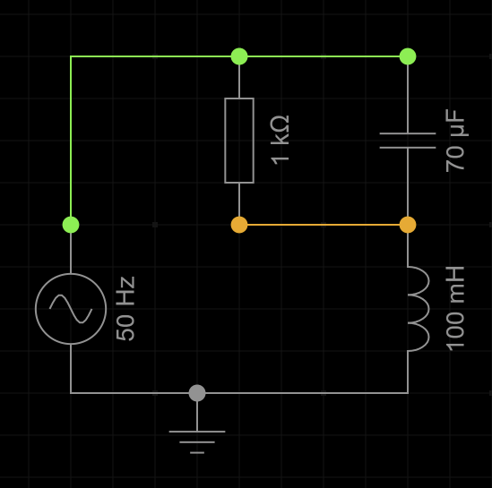

## 1. Impedanznetze
Falls du keinen Rechner für komplexe Zahlen hast, nutze einen Onlinerechner, wie [diesen hier](https://www.calculators-math.com/complex-number-calculator).

Ich habe zu den wichtigsten Teilen Prüfergebnisse hinzugefügt.
Wenn du keinen Ansatz findest, überspringe den jeweiligen Teil und nimm stattdessen das Prüfergebnis.

Tipp: Achte besonders auf den Winkel der Ergebnisse, ganz besonders auf dessen Vorzeichen.
Ein falscher Winkel kann dir die ganze Rechnung zerstören.

Gegeben ist folgendes Netzwerk (Spannungsquelle mit U = 230V, f = 50Hz):\

1. Bestimme die gesamt-Impedanz Z des Netzwerks (ohne Spannungsquelle)
   - Prüfergebnis $Z = 14 e^{-j82°} \Omega$
2. Bestimme den komplexen gesamt-Strom der Quelle.
   - Prüfergebnis $I = 16.4 e^{j82°} A$
3. Bestimme den komplexen Strom durch die Induktivität.
4. Bestimme das komplexe Spannungspotential am gelben Knoten.
   - Prüfergebnis $U_{Gelb} = 515 e^{j172°} V$ (Ja, das Ergebnis macht physikalisch Sinn. Nur um der Frage schonmal vorzubeugen...)
5. Bestimme die an der Induktivität umgesetzte WIRK-Leistung.
6. Bestimme die komplexe Scheinleistung der Quelle.
   - Prüfergebnis $S = 3.8 e^{-j82°} kVA$
7. Bestimme den komplexen Strom durch die Kapazität.\
Tipp: Bestimme zunächst die komplexe Spannung darüber.
   - Prüfergebnis $6.3 e^{j84°} A$
8. Statt $U = 230V$ gibt die Quelle nun $U = 230 e^{j45°} V$ aus.
Welche der errechneten Werte ändern sich dadurch und wie genau?\
Tipp: Das ist keine Fangfrage, mindestens ein Wert ändert sich.

## 2. Passive Filter

1. Bestimme die Impedanz eines Serienschwingkreises (Induktivität und Kapazität in Reihe geschaltet) in Abhängigkeit von $\omega$.
2. Bestimme die Impedanz eines Parallelschwingkrieses (Induktivität und Kapazität parallel) in Abhängigkeit von $\omega$.
3. Nutze deine Erkentnisse, um zwei verschiedene Arten von Bandpass (Lässt eine Frequenz/ein Frequenzband besonders gut durch) zu konstruieren.
4. Konstruiere zwei verschiedene Arten von Bandsperre (Lässt nur eine Frequenz/ein Frequenzband nicht durch, sonst alles).

