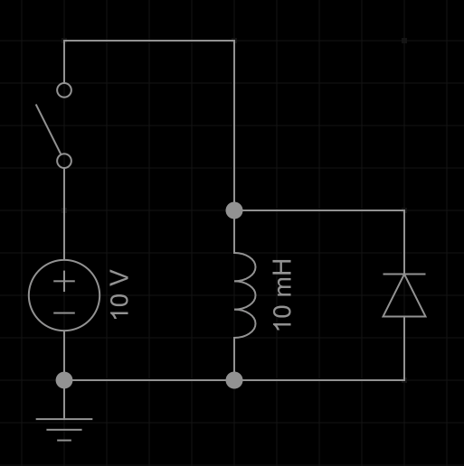

## 1. Dioden / LEDs
1. Eine LED mit $3.2V$ Vorwärtsspannung soll mit einer $9V$-Blockbatterie betrieben werden. Die LED ist für $20mA$ ausgelegt. Zeichne die Schaltung und bestimme einen passenden Vorwiderstand.
   1. Welche Leistung muss dieser Vorwiderstand mindestens aushalten können?
   2. Du hast dich vertan, die LED hat eigentlich eine Vorwärtsspannung von $5V$. Wie viel Strom fließt stattdessen?
2. Eine LED hat eine Vorwärtsspannung von $3.2V$, eine Andere $2.8V$. Beide LEDs werden parallel hinter einen gemeinsamen Vorwiderstand geschaltet. Welche der beiden LEDs leuchtet? Erkläre, warum nicht beide leuchten.
3. Wie verlaufen die Potentiale an den markierten Knoten in folgender Schaltung, wenn der Umschalter betätigt wird? (Kondensator zu beginn entladen)\

4. Die Diode ist ideal, hat also eine Vorwärtsspannung von 0V. Der Schalter wird zu beginn geschlossen und kurz danach wieder geöffnet. Wie verläuft der Strom durch die Induktivität (Zu beginn entladen)?\

   1. Wie verläuft der Strom, wenn die Diode nicht ideal ist?
   2. Welchen Einfluss hat die Vorwärtsspannung der Diode auf den Stromverlauf?
   3. Die meisten Schaltdioden haben eine Vorwärtsspannung von 0.7V. Wie könnte man trotzdem eine höhere Vorwärtsspannung erzeugen?
   4. Welches Problem könnte entstehen, wenn die (reale) Diode zu langsam ist?

