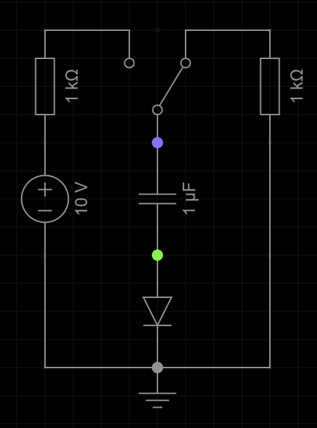

## 1. Dioden / LEDs
1. Eine LED mit $3.2V$ Vorwärtsspannung soll mit einer $9V$-Blockbatterie betrieben werden. Die LED ist für $20mA$ ausgelegt. Zeichne die Schaltung und bestimme einen passenden Vorwiderstand.
   1. Welche Leistung muss dieser Vorwiderstand mindestens aushalten können?
   2. Du hast dich vertan, die LED hat eigentlich eine Vorwärtsspannung von $5V$. Wie viel Strom fließt stattdessen?
2. Eine LED hat eine Vorwärtsspannung von $3.2V$, eine Andere $2.8V$. Skizziere beide Diodenkennlinien (nur Vorwärtsspannung) in ein gemeinsames Diagramm und erkläre daran, warum diese LEDs nicht parallelgeschaltet werden sollten.
3. Wie verlaufen die Potentiale an den markierten Knoten in folgender Schaltung, wenn der Umschalter betätigt wird? (Kondensator zu beginn entladen)\

